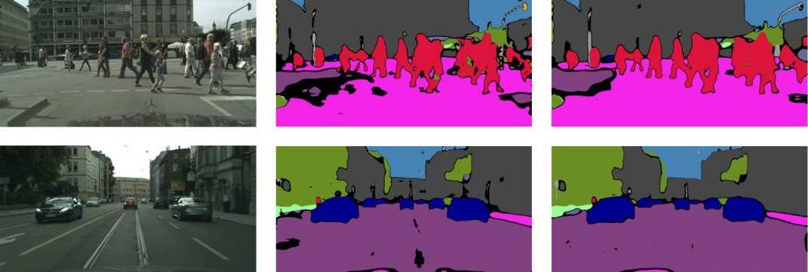

# Real-Time-Domain-Adaptation-in-Image-Segmentation
##### by Pietro Montressori, Micol Rosini, Chiara Vanderputten

- [Report Abstract](#report-abstract)
- [Requirements](#requirements)
- [Methods](#methods)
	- [BISENET](#bisenet)
	- [UNSUPERVISED LEARNING](#unsupervised-adversarial-network)
		- [How to run the code](#how-to-run-the-code-1)
	- [PSEUDO LABELS](#pseudo-labels)
		- [How to run the code](#how-to-run-the-code-2)
  	- [META PSEUDO LABELS](#meta-pseudo-labels)
		- [How to run the code](#how-to-run-the-code-3)

The repository contains the code for the project *Real-time Domain Adaptation in Semantic Segmentation* for the *Machine Learning and Deep Learning* 2021/2022 class. The repository is intended as a support tool for the report of the project and it contains examples of unsupervised-learning algorithms that involve Domain Adaptation tools and methods in the fields of Image Segmentation. 

### Report Abstract

Due to their ability to learn hierarchical representations of the image data, Convolutional Neural Networks (CNNs) have become a popular method for solving the task of pixel-wise semantic segmentation.
Since the state-of-the-art models rely on a large amount of annotated samples and synthetic data are significantly cheaper to obtain than real data, it is not surprising that Unsupervised Domain Adaptation reached a broad success within the semantic segmentation field.
In this paper, we have combined adversarial training, showing also a light version of the discriminator, with a self-supervised technique that allows us to create pseudo labels. To further improve the predictions of the adapted model we also implemented an algorithm to create Meta Pseudo Labels (MPL), that are constantly updated with a teacher-student learning technique.

## Requirements

- [torchvision](https://pytorch.org/vision/stable/index.html)
- [tensorboardX](https://github.com/lanpa/tensorboardX)
- [thop](https://pypi.org/project/thop/)
- [wandb](https://wandb.ai/site)

## Method

### Bisenet
The model used in this work is BiSeNet which is composed of two parts: *Spatial Path* (SP) and *Context Path* (CP). The first component is used to preserve the spatial information and generate high-resolution features, it contains three layers to obtain the 1/8 feature map. Each layer includes a convolution with stride = 2 and padding = 1, followed by batch normalization and ReLU. The Context Path utilizes a lightweight model, which can be ResNet-101 or ResNet-18, and can downsample the feature map fast to encode high-level semantic context information, then is added a global average pooling to provide a large receptive field with global context information. The up-sampled output feature of global pooling is then combined with the features of the lightweight model.

### Unsupervised Adversarial Network

In order to perform domain adaptation between the source data **GTA5** and the target data **Cityscapes**, a discriminator is used together with the segmentation network.
For the source domain, a segmentation loss is computed as the cross-entropy loss between the ground truth annotations for source images and the segmentation output.
For the target domain, in order to make the target prediction of the model closer to the one of the source, a  binary cross-entropy loss called **adversarial loss** trains the segmentation network to fool the discriminator by maximizing the probability of the target prediction being considered as the source prediction

The discriminator will get two predictions and will try to infer if the input is from the target or the source domain, it is trained with a binary cross-entropy loss.

#### How to run the code

Running `trainUnsupervised.py` with the possibility to select:

- the type of discriminator ( 0 = FCD, 1 = DSC)
- the initial learning rate
- the model optimizer
- the discriminator optimizer

### Pseudo labels

- the segmentation model is trained for 50 epochs until it is capable of producing confident annotations for the target domain.
- confident annotations for the target domain are produced by filtering pixels with high prediction confidence in the image using a **max probability threshold (MPT)**. For each class, a different MPT is defined as the median of all the probabilities of pixels predicted to belong to that class. Pixels with a probability lower than the threshold are classified as background, while others are classified with their correct category. If the median is higher than 0.9, the threshold for the specified class is set at 0.9.
- the loss segmentation is computed for the target domain using the generated pseudo labels which is then incorporated into the target loss that will be back-propagated

#### How to run the code

Running `createpseudolabels.py` for creating the pseudo labels then runnning `TrainUnsupervised.py` with the following choice of parameters:

- the type of discriminator ( 0 = FCD, 1 = DSC)
- the initial learning rate
- the model optimizer  
- the discriminator optimizer 
- arg: usepseudolabels = 1

### Meta pseudo labels

The systematic mechanism of **Meta pseudo labels (MPL)** improves pseudo labels.
It involves two actors:
- ***The teacher:*** a pretrained network aimed at creating the pseudo labels.
- ***The Student:*** the segmentation model, which provides annotations for input images.

The MPL method leverages the performance of the student on the pseudo-labeled datasets to improve the quality of the pseudo-labels generated by the teacher.
The teacher and student are trained in parallel:

-The student learns both from pseudo-labeled data from Cityscapes annotated by the teacher, and labeled images from GTA5.
-The teacher learns from the reward signal that indicates how well the student performs on the pseudo-labeled dataset.

#### How to run the code

Running `MPL.py` with the following choice of parameters:

- the type of discriminator ( 0 = FCD, 1 = DSC)
- the initial learning rate
- the model optimizer  
- the discriminator optimizer
